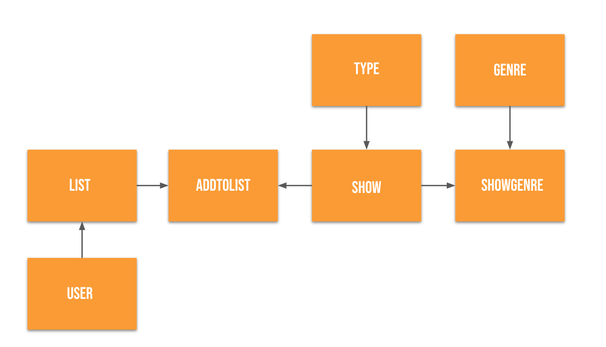
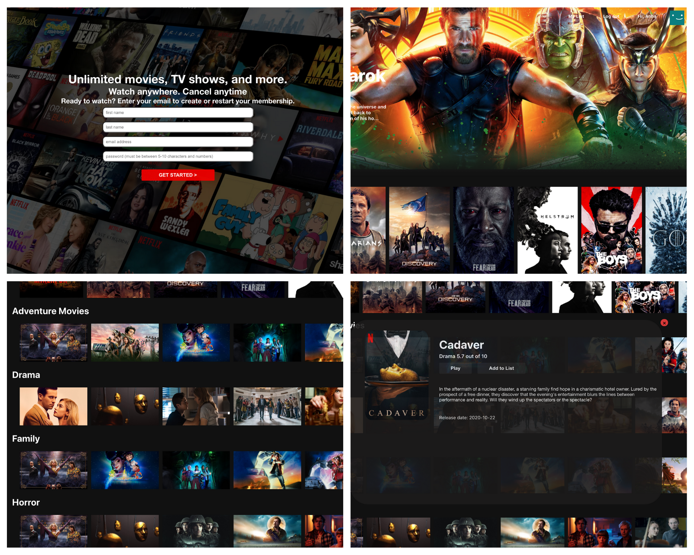

# Netflax
*Live Demo Coming Soon!*

Netflax is a Movie/TV Show Searching App where users can browse through thounsands of shows based on genres. Netflax uses the MovieDB api to get the latest movies and shows available for streaming. Netflax was inspired by the popular streaming service, Netflix.

## Features

### Functionalities
Users can:
  * log-in/out and create an account
  * view latest movies and tv shows by genre
  * add shows to 'My List'
  * remove shows from 'My List'
  * click on a show and read details
  
 Extras:
  * Header banner changes every time user comes back to main page
  * Main page greets users upon logging in
  * This app uses an external API from MovieDB for it's seed data

### Active Record Associations
 * There are 7 models that have the following associations ```has_many, belongs_to and has_many, through: ```

## Domain Model
 </img>

## Screenshots
 </img>


## Tech Stack
 * Ruby on Rails
 * Rails as an API
 * PostgreSQL
 * HTML/CSS
 * Active Record
 * Custom CSS
 
## Gems 
 * rack-cors
 * active_model_serializers
 * Rest-Client API
 
## Build Status
 This project is complete.
 
## Future Features
 * re-format My List layout (CSS)
 * Create user account page
 * Implement show trailer
 
 ## Set-up for running the app
 
 * Clone this repo into your local computer
 * CD into the repo 'Netflax'
 
 Backend Set-Up:
 * CD once more into 'backend' folder.
 * Run 'bundle install' to install all dependencies
 * Run 'rails db:create' to create the tables for the datables
 * Run 'rails db:migrate' and "rails db:seed' to save the seed data.
 * Run 'rails s' to start the server
 
 Frontend Set-Up:
 * Open another terminal and CD into the 'frontend' folder
 * Run 'npm install' to install all dependencies
 * Run 'npm start' and confirm 'Yes' which will open your web browser and start the application!
 
 
## Creator
 * [Anna Kim](https://github.com/iannakim)
 
